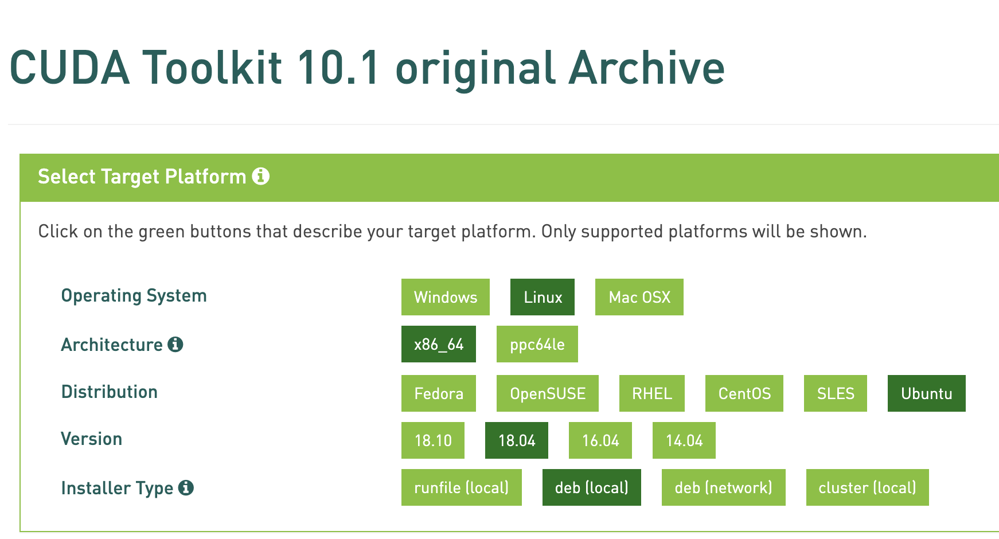
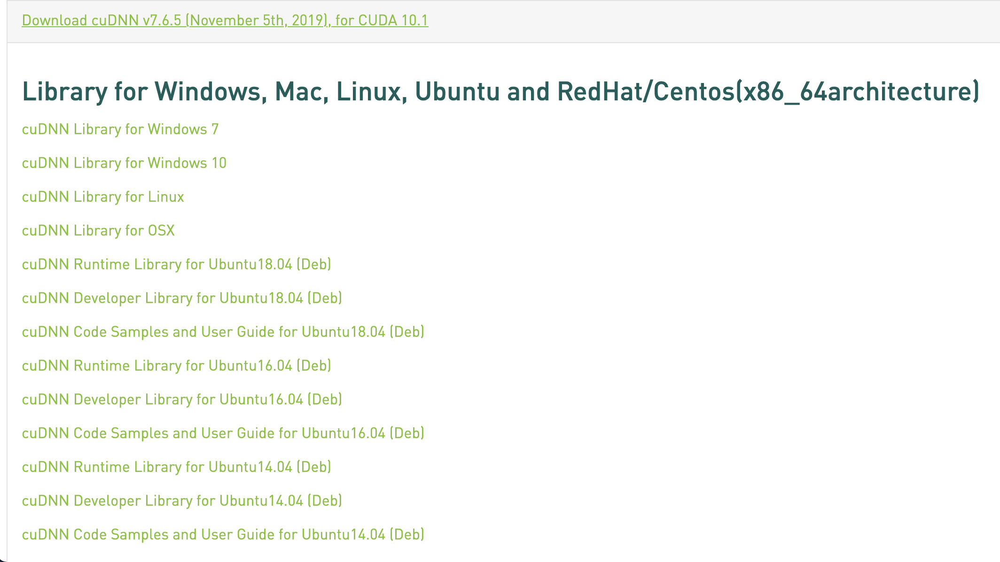
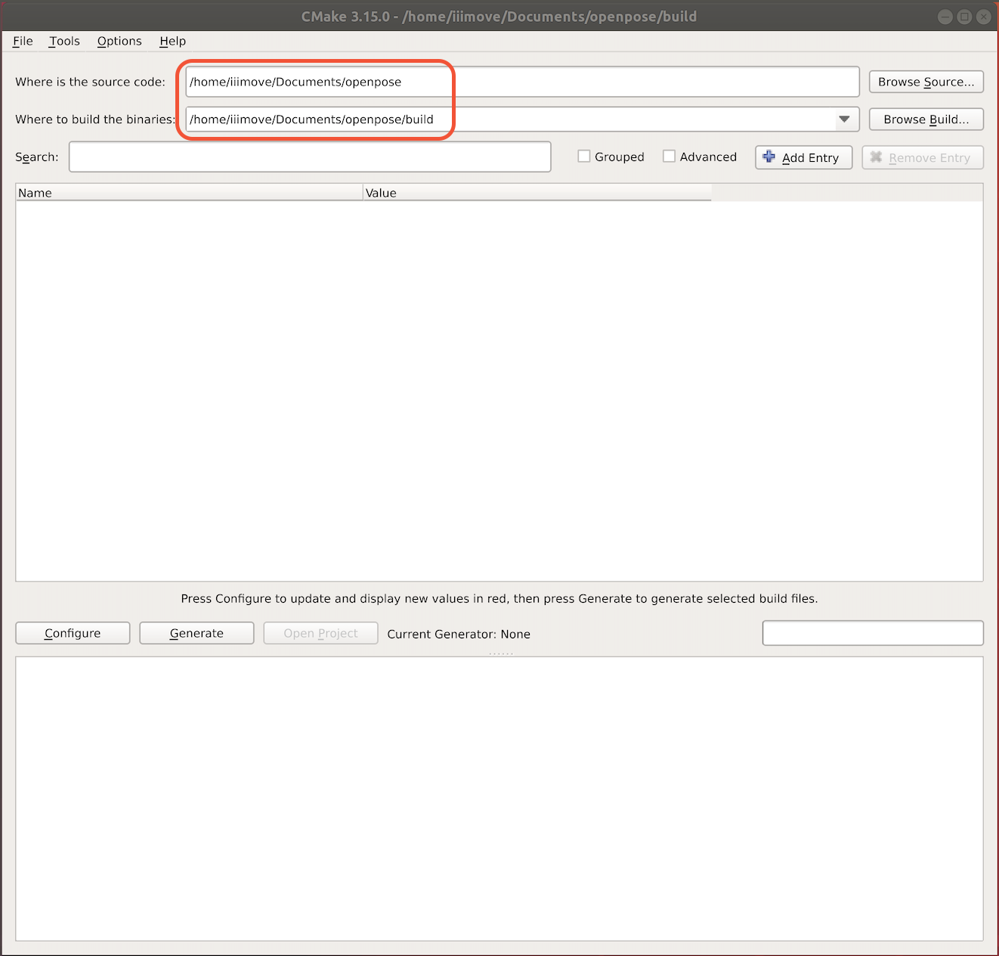
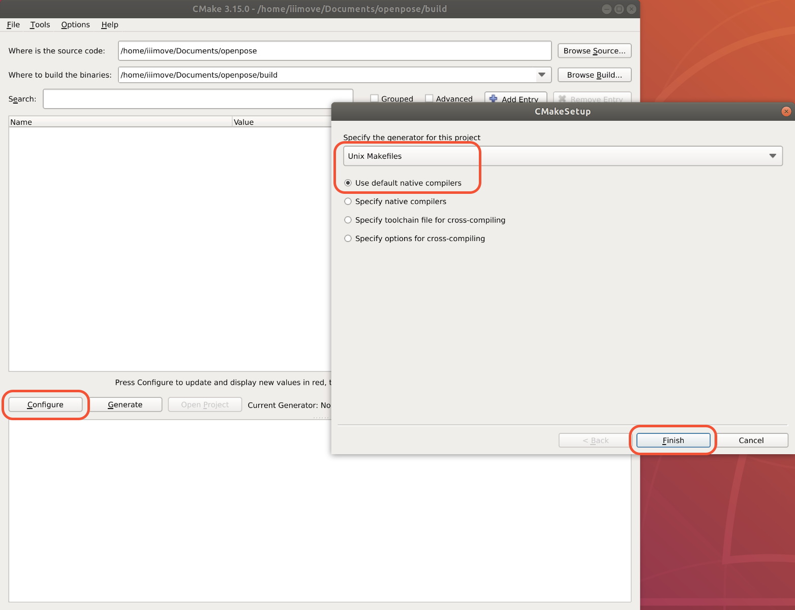
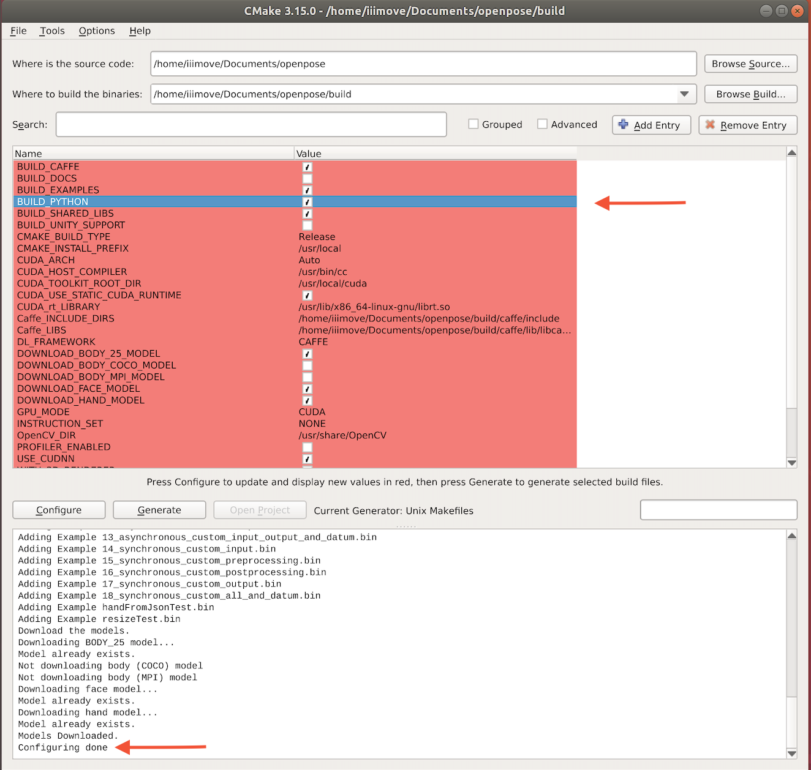
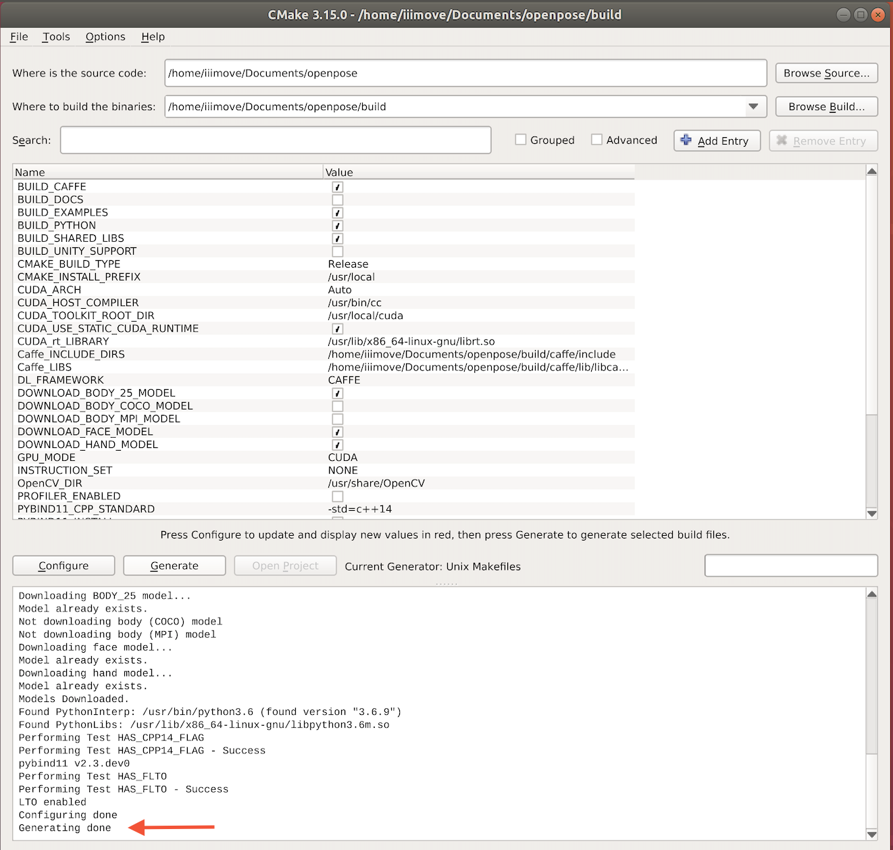

# OpenPose 安裝教學

## 版本確認

首先確認手邊ubuntu系統，需要安裝哪個版本的套件
舉例來說:

- Ubuntu: 18.04/64-bit
- GPU: RTX-2080
- Cuda: 10.1
- Cudnn: 7.6.5
   Cuda版本根據GPU的計算能力來安裝
   Cudnn版本根據Cuda版本來安裝
   可以到<https://zh.wikipedia.org/zh-tw/CUDA>找到GPU計算能力
  - 2080的計算能力是7.5 -> 下載Cuda10.1
  - Cuda10.1 -> 下載Cudnn7.6.5

## 1. 安裝 kernel headers 以及 development packages installed

`sudo apt-get install linux-headers-$(uname -r)`

## 2. 完全刪除 NVIDIA-Driver / Cuda / Cudnn

可以全部複製到終端機上，如果中間有出現錯誤，那很好，代表完全沒有裝

```bash
sudo apt-get purge nvidia*
sudo apt-get autoremove
sudo apt-get autoclean
sudo rm -rf /usr/local/cuda*
sudo /usr/local/cuda-X.Y/bin/uninstall_cuda_X.Y.pl
sudo /usr/bin/nvidia-uninstall
```

## 3. 安裝 gcc

按順序執行下面的指令，

```bash
sudo apt upgrade
sudo apt update
sudo apt install gcc
```

## 4. 安裝 Cuda

1. 點開<https://developer.nvidia.com/cuda-toolkit-archive>
2. 找到一開始確認好的版本(這邊以ubuntu18.04/Cuda10.1為例)
3. 如圖所示，找到對應ubuntu的版本並一路點下去，最後一步請選.deb(local)，接著執行以下步驟
   

   ```bash
   1. Download the .deb file
   2. sudo dpkg -i cuda-repo-ubuntu1804-10-1-local-10.1.105-418.39_1.0-1_amd64.deb
   3. sudo apt-key add /var/cuda-repo-<version>/7fa2af80.pub
   4. sudo apt-get update
   5. sudo apt-get install cuda-10.1
   ```

4. 將cuda加進.bashrc

   ```bash
   export PATH=$PATH:/usr/local/cuda/bin
   export LD_LIBRARY_PATH=$LD_LIBRARY_PATH:/usr/local/cuda/lib64
   ```

   **確認 Cuda 以及 NVIDIA-Driver有確實裝好**

   - 確認Cuda版本: 請輸入`nvcc -V`
   - 確認driver版本: 請輸入`nvidia-smi`

## 5. 安裝 Cudnn

1. 點開<https://developer.nvidia.com/rdp/cudnn-archive>
2. 根據Cuda版本找到Cudnn的版本(Cuda-10.1 對應到 Cudnn-7.6.5)
3. 點開之後會看到，如下圖所示:
   

   請下載下面三個安裝包(.deb):
   - cuDNN Runtime Library for Ubuntu18.04 x86_64 (Deb)
   - cuDNN Developer Library for Ubuntu18.04 x86_64 (Deb)
   - cuDNN Code Samples and User Guide for Ubuntu18.04 x86_64 (Deb)

   **確認 Cudnn 有確實裝好**
   請按順序執行

      ```bash
      cp -r /usr/src/cudnn_samples_v8/ $HOME`
      cd $HOME/cudnn_samples_v8/mnistCUDNN`
      make clean && make`
      ./mnistCUDNN`
      ```

   輸入完`./mnistCUDNN`之後，若是成功，你會看到`Test passed!`

## 6. 安裝 Cmake

1. 點開<https://cmake.org/files/>，找到3.15以上的版本
   (若連結失效，請點這個<https://cmake.org/download/>)
   (若還是不行，請參考這篇<https://askubuntu.com/questions/829310/how-to-upgrade-cmake-in-ubuntu>)
2. 請按順序執行

   ```bash
   sudo apt remove cmake
   Download cmake-<version>.sh to ${CMAKE_PATH}
   sudo cp -r ${CMAKE_PATH}/cmake-<version>.sh /opt
   sudo bash /opt/${CMAKE_PATH}/cmake-<version>.sh
   sudo ln -s /opt/${CMAKE_PATH}/cmake-<version>/bin/* /usr/local/bin
   ```

   **確認cmake版本**: `cmake --version`

## 7. 安裝 OpenPose

   1. **Clone OpenPose**

      ```bash
      git clone https://github.com/CMU-Perceptual-Computing-Lab/openpose
      cd openpose/
      git submodule update --init --recursive --remote
      ```

   2. **安裝 Dependancy**

      ```bash
      sudo apt-get install protobuf-compiler libprotobuf-dev
      sudo apt-get install libgoogle-glog-dev
      sudo apt-get install libopencv-dev
      sudo apt-get install libboost-all-dev
      sudo apt-get install libhdf5-dev
      sudo apt-get install libatlas-base-dev
      sudo apt-get install libzbar0
      ```

   3. **開始編譯**
      請按順序執行，{OPENPOSE_PATH}: openpose當前路徑

      ```bash
      cd {OPENPOSE_PATH}
      mkdir build/
      cd build/
      cmake-gui ..
      ```

      1. 請先確認openpose的路徑以及所要編譯的環境路徑有沒有錯，如下圖:
         (openpose路徑會根據不同環境有所改變)
         
      2. 點選`Configure`，確認使用`Unix Makefiles`以及`Use Default native compilers`並點選`Finish`，如下圖:
         
      3. 完成後，你會看到`Configuring done`
         **請記得勾選`BUILD_PYTHON`**，如下圖:
         
      4. 再點選一次`Configure`，接著點選`Generate`，完成後你將會看到`Generating done`，如下圖:
         

      5. Compilation
         請按順序執行，並確認現在路徑在openpose底下的build

         ```bash
         cd {OPENPOSE_PATH}/build
         make -j`nproc`
         ```

### 測試

請使用python3以上測試
若沒安裝opencv請下: `pip install opencv-python`

```bash
cd build/examples/tutorial_api_python/
python openpose_python.py
```
